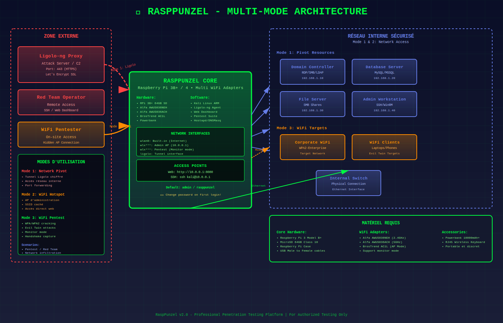

# RaspPunzel

**Professional Penetration Testing Platform for Raspberry Pi**

A discrete and autonomous penetration testing implant designed for red team operations, security assessments, and authorized network evaluations.

  





---

## Hardware Requirements

| Component | Specification | Status |
|-----------|---------------|---------|
| **Raspberry Pi** | 3 Model B+ or 4 (recommended) | Required |
| **MicroSD Card** | 64GB Class 10 minimum | Required |
| **WiFi Adapters** | Multiple USB adapters with monitor mode | Required |
| **Power Supply** | Portable power bank 10,000mAh+ | Recommended |
| **Enclosure** | Discrete case for deployment | Optional |

### Tested WiFi Adapters

**Primary Adapters (Recommended):**
- **Alfa AWUS036NEH** - Ralink RT3070 chipset (2.4GHz)
- **Alfa AWUS036ACH** - Realtek RTL8812AU chipset (2.4/5GHz)
- **BrosTrend AC1L AC1200** - Suitable for AP mode

**Alternative Adapters:**
- TP-Link AC600 series
- Panda PAU09
- Any adapter with confirmed monitor mode support

---

## Core Capabilities

### Network Access Methods

**Mode 1: Remote Network Pivot**
- OpenVPN tunnel establishment for remote access
- SSH tunneling and port forwarding
- Encrypted command and control channel
- Network discovery and mapping

**Mode 2: On-site WiFi Hotspot**
- Hidden WiFi access point deployment
- Direct network access via wireless connection
- Discrete maintenance access
- Local administration interface

**Mode 3: WiFi Penetration Testing**
- WPA/WPA2/WPS security assessment
- Evil twin and rogue access point attacks
- Wireless network reconnaissance
- Multi-adapter coordination

### Integrated Tool Suite

**Network Reconnaissance:**
- Nmap - Network discovery and port scanning
- Masscan - High-speed port scanner
- Kismet - Wireless network detector
- Network topology mapping

**Wireless Security Testing:**
- Aircrack-ng suite - Complete WiFi security toolkit
- Wifite - Automated wireless attacks
- Reaver/Bully - WPS vulnerability testing
- Wifiphisher - Rogue access point framework

**Web Application Security:**
- SQLMap - SQL injection testing
- Nikto - Web vulnerability scanner  
- Gobuster - Directory and file brute forcing
- OWASP ZAP integration

**Password Security:**
- John the Ripper - Password hash cracking
- Hashcat - GPU-accelerated password recovery
- Hydra - Network authentication brute forcing
- Wordlist management and generation

**Post-Exploitation:**
- Metasploit Framework
- Network pivoting capabilities
- Credential harvesting
- Persistence mechanisms

---

## Installation

### Automated Installation

```bash
git clone https://github.com/theimposterz/rasppunzel.git
cd rasppunzel
sudo ./install.sh
```

The installation script will:
1. Configure interactive parameters
2. Install required dependencies
3. Set up network services
4. Configure web dashboard
5. Install penetration testing tools
6. Create authentication credentials

### Manual Configuration

For advanced users requiring custom configurations:

```bash
# Network configuration
sudo ./scripts/setup-network.sh

# Tool installation
sudo ./scripts/setup-tools.sh

# Web dashboard setup
sudo ./scripts/install-web-dashboard.sh

# Service management
sudo ./scripts/service-manager.sh
```

---

## Access Methods

### WiFi Access Point

```
Network Name: MAINTENANCE_WIFI (hidden)
Authentication: WPA2-PSK
Default IP: 192.168.10.1
Web Interface: http://192.168.10.1:8080
```

### SSH Access

```bash
ssh admin@192.168.10.1
# Authentication: Username/password or SSH key
```

### Web Dashboard

The web interface provides:
- Real-time system monitoring
- Tool execution and management
- Network discovery results
- Log viewing and analysis
- Service control

---

## Architecture

```
rasppunzel/
├── install.sh                     # Main installation script
├── scripts/                       # Management scripts
│   ├── setup-network.sh          # Network configuration
│   ├── setup-tools.sh            # Tool installation
│   ├── install-web-dashboard.sh  # Web interface setup
│   ├── service-manager.sh        # Service management
│   └── update-system.sh          # System updates
├── web/                           # Web interface
│   ├── dashboard.html            # Main dashboard
│   ├── login.html               # Authentication page
│   └── api/                     # Backend API
├── config/                        # Configuration templates
│   ├── network/                  # Network settings
│   ├── services/                # Service configurations
│   └── systemd/                 # System services
└── examples/                     # Usage documentation
```

---

## Usage Examples

### Network Discovery

```bash
# Host discovery
nmap -sn 192.168.1.0/24

# Port scanning with OS detection
nmap -sS -O -sV target_ip

# Network topology mapping
nmap --traceroute --script traceroute-geolocation target_network
```

### WiFi Security Assessment

```bash
# Automated wireless testing
wifite --wpa --dict /usr/share/wordlists/rockyou.txt

# WPS vulnerability testing
reaver -i wlan1mon -b target_bssid -vv

# Evil twin attack
wifiphisher -aI wlan1 -jI wlan0
```

### Web Application Testing

```bash
# Vulnerability scanning
nikto -h http://target.com

# SQL injection testing
sqlmap -u "http://target.com/page.php?id=1" --batch --dbs

# Directory enumeration
gobuster dir -u http://target.com -w /usr/share/wordlists/dirb/common.txt
```

---

## Service Management

### System Commands

```bash
# Service control
make start          # Start all services
make stop           # Stop all services
make restart        # Restart services
make status         # System status

# Advanced management
./scripts/service-manager.sh menu    # Interactive menu
./scripts/update-system.sh full      # Complete update
```

### Monitoring

```bash
# Real-time logs
sudo journalctl -u rasppunzel-web -f

# System health check
./scripts/service-manager.sh check

# Performance monitoring
htop
iotop
```

---

## Security Considerations

### Post-Installation Security

1. **Change Default Credentials:**
```bash
sudo passwd admin
sudo nano /etc/hostapd/hostapd.conf
```

2. **SSH Key Authentication:**
```bash
ssh-keygen -t ed25519 -C "rasppunzel@deployment"
# Copy public key to authorized_keys
# Disable password authentication
```

3. **Network Configuration:**
```bash
# Change WiFi channel to avoid interference
sudo nano /etc/hostapd/hostapd.conf
# Adjust transmission power
iwconfig wlan1 txpower 15
```

### Operational Security

- Deploy in locations with appropriate physical security
- Use encrypted communication channels
- Regularly update system and tools
- Monitor for detection and anomalies
- Maintain operational logs for assessment

---

## Use Cases

### Authorized Penetration Testing
- Internal network security assessment
- Wireless security evaluation
- Physical security testing
- Social engineering assessments

### Red Team Operations
- Persistent network access establishment
- Covert operations support
- Network reconnaissance and mapping
- Lateral movement facilitation

### Security Training
- Controlled environment testing
- Hands-on cybersecurity education
- Scenario-based learning
- Practical tool demonstration

---

## Troubleshooting

### Common Issues

| Issue | Solution |
|-------|----------|
| WiFi interface not detected | Check USB adapter compatibility and drivers |
| Web interface inaccessible | Restart nginx service |
| No DHCP assignments | Restart dnsmasq service |
| Tool execution failures | Verify PATH environment variables |

### Diagnostic Commands

```bash
# System health check
./scripts/service-manager.sh check

# Network interface status
ip addr show && iwconfig

# Service status
systemctl status rasppunzel-web
systemctl status hostapd
systemctl status dnsmasq

# Log analysis
sudo journalctl --since "1 hour ago"
```

---

## Legal Notice

**AUTHORIZED USE ONLY**

This tool is designed exclusively for authorized security testing by qualified professionals. Users must:

- Obtain explicit written authorization before deployment
- Comply with all applicable laws and regulations
- Use only for legitimate security testing purposes
- Respect privacy and data protection requirements
- Document and report findings responsibly

Unauthorized access to computer systems is illegal. Users assume full responsibility for lawful and ethical use.

---

## Contributing

Contributions are welcome from security professionals and researchers:

1. Fork the repository
2. Create a feature branch
3. Implement improvements with proper testing
4. Submit a pull request with detailed documentation

### Reporting Security Issues

For security vulnerabilities or concerns:
- Use private disclosure through GitHub Security Advisories
- Include detailed reproduction steps
- Allow reasonable time for response and fixes

---

## Changelog

**v1.0.0** - Initial Release
- Complete automated installation system
- Multi-mode operation capabilities
- Integrated web dashboard
- Comprehensive tool suite
- Professional documentation

---

## License

This project is licensed under the MIT License - see the LICENSE file for details.

---

## Acknowledgments

- Offensive Security for Kali Linux
- Raspberry Pi Foundation for hardware platform
- Open source security community
- Tool developers and maintainers

---

<div align="center">

**For authorized security testing only**

RaspPunzel v1.0 - Professional Penetration Testing Platform

</div>